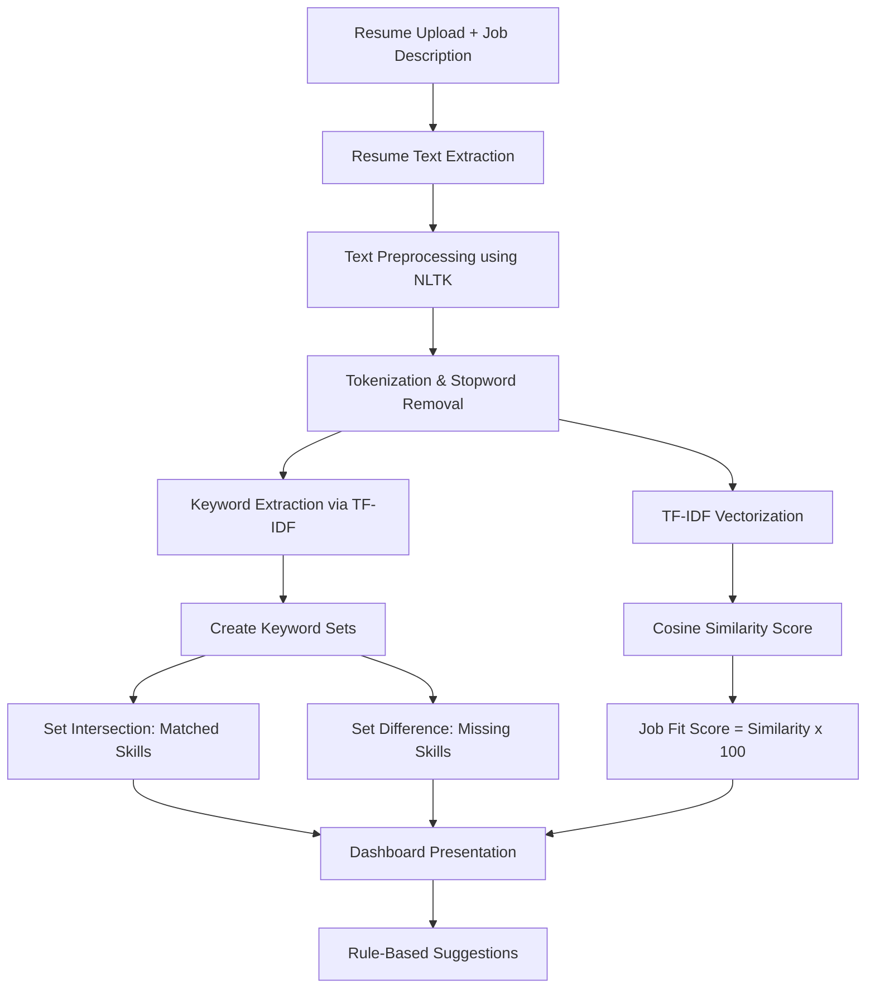

# AI-Powered Resume Analyzer & Job Fit Assistant

An NLP-based web application that parses resumes (PDF and DOCX), extracts key terms using TF-IDF, compares them to a Job Description using mathematical set operations, calculates a match score via cosine similarity, and generates actionable, rule-based resume improvement suggestions.

Built using **Python**, **NLTK**, **scikit-learn**, and **Streamlit**—with **NO external APIs, chatbots, or LLMs** to protect candidate data privacy.

---
## 🚀 Live Demo

[](https://ai-resume-analyzer-project-ejmk5mfvqjxzsmcijszjnr.streamlit.app)

👉 [Try the AI Resume Analyzer](https://ai-resume-analyzer-project-ejmk5mfvqjxzsmcijszjnr.streamlit.app)
## 🏗️ High-Level Architecture

The application implements the following strict linear processing pipeline:



---

## 🛠️ Technology Stack

* **Backend Core**: Python 3.12
* **NLP Preprocessing**: NLTK (Natural Language Toolkit)
* **Vectorization & Similarity**: scikit-learn
* **PDF Parser**: pypdf
* **DOCX Parser**: python-docx
* **Frontend Dashboard**: Streamlit (SaaS design, customized CSS, responsive layout)

---

## 🧠 Core Scientific Concepts & Math

### 1. Text Preprocessing
The application utilizes `NLTK` to clean the extracted raw text to ensure high-fidelity comparisons:
* **Case Normalization**: Converts all text to lowercase to ensure consistency (e.g., `Python` matches `python`).
* **Special Term Preservation**: Protects tricky programming signatures (`C++` -> `cplusplus`, `C#` -> `csharp`, `.NET` -> `dotnet`, `Node.js` -> `nodejs`) using regex mapping before tokenizer split, preventing characters like `+`, `#`, or `.` from being dropped.
* **Tokenization**: Uses NLTK's `word_tokenize` to split the text into discrete words.
* **Stopword Removal**: Removes non-informative words (e.g., "the", "and", "is", "for") using NLTK's default English stopwords list to prevent them from skewing the similarity results.
* **Punctuation Stripping**: Filters out trailing commas, parentheses, and brackets.

### 2. TF-IDF Keyword Extraction
**TF-IDF** (Term Frequency-Inverse Document Frequency) measures how important a word is to a document relative to a corpus:
$$\text{TF-IDF}(t, d, D) = \text{TF}(t, d) \times \text{IDF}(t, D)$$

* **Term Frequency (TF)**: How often a term $t$ appears in document $d$ (e.g., resume).
* **Inverse Document Frequency (IDF)**: Measures how rare a term is across the corpus of documents $D$. Words appearing in both documents get a slightly lower IDF weight, but still retain positive scores.
* **N-Grams**: The vectorizer is configured to extract unigrams and bigrams (`ngram_range=(1,2)`). This enables the system to capture compound technical phrases such as `"machine learning"`, `"data structures"`, or `"software development"` in addition to single words.

### 3. Skill Matching via Set Operations
The top $N$ keywords from both the Resume and the Job Description are converted into mathematical sets ($R$ and $J$). We perform binary set operations to classify skills:
* **Matched Skills**: The intersection of the two sets:
  $$\text{Matched} = R \cap J$$
* **Missing Skills**: The set difference of the job description keywords minus the resume keywords:
  $$\text{Missing} = J \setminus R$$

### 4. Cosine Similarity & Job Fit Score
To evaluate the semantic overlap between the Resume ($A$) and Job Description ($B$) in vector space, the preprocessed texts are vectorized. The cosine of the angle between their two TF-IDF vectors is calculated:
$$\text{Cosine Similarity}(A, B) = \cos(\theta) = \frac{A \cdot B}{\|A\| \|B\|} = \frac{\sum_{i=1}^{n} A_i B_i}{\sqrt{\sum_{i=1}^{n} A_i^2} \sqrt{\sum_{i=1}^{n} B_i^2}}$$

* A score of **1.0** ($100\%$) indicates that the two documents share identical word distributions.
* A score of **0.0** ($0\%$) indicates that the documents have no terms in common.
* The **Job Fit Score** is computed as:
  $$\text{Job Fit Score} = \text{Cosine Similarity} \times 100$$

---

## 🚀 Installation & Setup

1. **Clone or navigate** to the project directory:
   ```bash
   cd "c:\Users\jiyaa\OneDrive\Desktop\ai resume analyzer"
   ```

2. **Install Dependencies**:
   Ensure you are using Python 3.8+ (Python 3.12 is recommended). Install the requirements:
   ```bash
   pip install -r requirements.txt
   ```
   *(Note: The system will automatically download NLTK tokenizers and stopwords on the first run.)*

3. **Run the Application**:
   Launch the Streamlit web dashboard:
   ```bash
   streamlit run app.py
   ```

4. **Access the App**:
   Open your browser and navigate to the local address provided by Streamlit (usually `http://localhost:8501`).

---

## 🛡️ Privacy and Safety

Because this system runs completely locally without external LLM API calls:
* Your uploaded resume data is never sent to OpenAI, Anthropic, or any third-party model provider.
* The analysis is deterministic, reproducible, and private.
